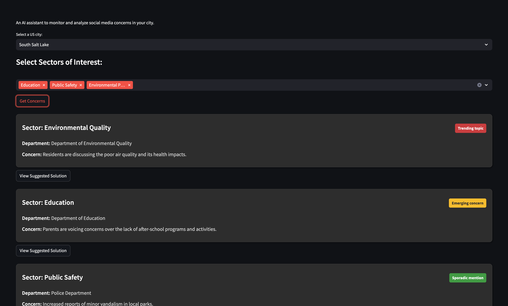

# CityPulse

An AI assistant to monitor and analyze social media concerns in your city.

## Screenshots



## Implemented social media platforms
- [x] Twitter
- [ ] Facebook
- [ ] Instagram
- [ ] Reddit
- [ ] TikTok
- [ ] YouTube

## Table of Contents

- [Introduction](#introduction)
- [Features](#features)
- [Project Structure](#project-structure)
- [Getting Started](#getting-started)
  - [Prerequisites](#prerequisites)
  - [Setting Up the Python Environment](#setting-up-the-python-environment)
  - [Installing Dependencies](#installing-dependencies)
  - [Setting Up Secret Keys](#setting-up-secret-keys)
    - [OpenAI API Key](#openai-api-key)
    - [Streamlit Secrets](#streamlit-secrets)
- [Running the Application](#running-the-application)
- [Usage Guide](#usage-guide)
  - [Selecting a City](#selecting-a-city)
  - [Choosing Sectors of Interest](#choosing-sectors-of-interest)
  - [Viewing Concerns and Solutions](#viewing-concerns-and-solutions)
- [Deployment](#deployment)
- [Contributing](#contributing)
- [License](#license)
- [Additional Resources](#additional-resources)

---

## Introduction

**CityPulseAI** is an interactive Streamlit application designed to assist government officials and stakeholders in monitoring and analyzing public concerns expressed on social media space. The app identifies key issues within selected sectors and provides suggested solutions, acting as the chief executive of the corresponding department.

---

## Features

- **City Selection**: Choose from a comprehensive list of U.S. cities.
- **Sector Selection**: Select sectors of interest from an extensive list covering various government departments.
- **Concern Analysis**: Get AI-generated summaries of public concerns trending in your selected city and sectors.
- **Suggested Solutions**: View AI-generated action plans to address specific concerns, crafted as if by the department's chief executive.
- **Interactive UI**: Expandable sections to view concerns and solutions without navigating away.
- **Dark Theme Support**: A visually appealing interface optimized for Streamlit's Dark Theme.

---

## Project Structure

```bash
├── app.py               # Main Streamlit application script
├── sector_list.py       # Contains the list of sectors and corresponding departments
├── concern.py           # Defines the Concern data class
├── grok.py              # Contains functions to get concerns (mock and actual)
├── gov_ceo.py           # Contains function to generate solutions using OpenAI API
├── assets/
│   └── cities.csv       # CSV file containing the list of U.S. cities
├── requirements.txt     # Python dependencies
├── README.md            # Project documentation

```

---

## Getting Started

### Prerequisites

- **Python 3.7 or higher**
- **OpenAI API Key**: Required to generate AI responses.
- **Grok API Key**: Required to analize trends and feed of X
- **Streamlit**: A Python library for creating web apps.

### Setting Up the Python Environment

1. **Install Python**:

   Ensure you have Python 3.10 or higher installed. You can download it from the [official website](https://www.python.org/downloads/).

2. **Create a Virtual Environment** (Optional but recommended):

   ```bash
   python -m venv citypulse_env
   ```
2. **Activate the Virtual Environment** 

```bash
source citypulse_env/bin/activate
```
Installing Dependencies
Install the required Python packages using pip:

```bash
pip install -r requirements.txt
```
This will install:
```
streamlit
openai
pandas
datetime
```

## Streamlit Secrets
Streamlit provides a secure way to manage secrets like API keys.

In the root directory of your project, create a `secrets.toml` File in `.streamlit` Folder:

Add Your API Key to secrets.toml:

`secrets.toml`
```bash
X_API_KEY = "xai-your-key"
OPENAI_API_KEY = "sk-your-key"
```


In your Python scripts, you can access the API key as follows:

```python
import streamlit as st
import openai

openai.api_key = st.secrets["OPENAI_API_KEY"]
```
**Important**: Do not commit secrets.toml to version control.

### Using Secrets in Production:

When deploying your app with Streamlit sharing or Streamlit Cloud, you can set secrets in the app's settings under the "Secrets" section. Refer to the Streamlit [Secrets Management documentation](https://docs.streamlit.io/deploy/streamlit-community-cloud/deploy-your-app/secrets-management) for more details.


## Running the Application
With your virtual environment activated and dependencies installed, you can run the Streamlit app using the following command:

```bash
streamlit run app.py
```
This will start the application, and you'll see a URL in the terminal. Open this URL in your web browser to interact with the app.


## Usage Guide

### Selecting a City
Use the `"Select a US city"` dropdown to choose a city.
The list includes a comprehensive selection of U.S. cities.
Choosing Sectors of Interest

Under `"Select Sectors of Interest"`, select one or more sectors.
The sectors represent various government departments (e.g., Education, Healthcare, Public Safety).
Viewing Concerns and Solutions

### Get Concerns:

Click the `"Get Concerns"` button.
The app will analyze and display concerns related to the selected city and sectors.

### View Suggested Solution:

For each concern, click the `"View Suggested Solution"` button.
The solution will expand below the concern, showing a loading spinner while it generates.
The AI-generated solution is presented as an action plan from the department's chief executive.

### Deployment
To deploy the app for wider use, consider the following options:

### Streamlit Cloud

Create a free account on Streamlit Cloud.
Connect your GitHub repository containing the app.
Set your secrets in the app's settings.
Setting Secrets:

In the app dashboard, navigate to "Settings" > "Secrets".
Add your OPENAI_API_KEY and X_API_KEY.
Documentation:

Refer to the Streamlit Cloud Deployment Guide for detailed instructions.
Other Hosting Options

### Contributing
Contributions are welcome! If you have suggestions for improvements or new features, please open an issue or submit a pull request.